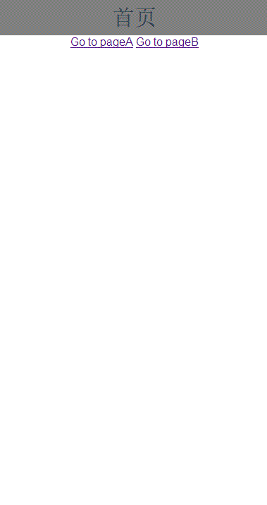

# Vue2-transition
> 使用vue-router实现页面切换功能

## 演示：


## 记录状态

路由页面中，利用window.history.go(-1)功能实现路由回调

``` javascript
Router.prototype.goBack = function () { // 原型上添加返回函数
  this.isBack = true
  window.history.go(-1)
}
```

## 监听路由

过度文件(transitionPage.vue)中：设立isBack来判断前进和后退并执行相应过渡动画

``` javascript
beforeRouteUpdate (to, from, next) { // 路由更新时将执行
  // 点击分两种， 前进和后退， 初始化后isBack是 undefined， 此时点击前进将左滑并赋值 isBack 为false， 点击返回会先执行goBack函数， 此时isBack变为true, 执行右滑动， 最后又将 isBack赋为 false
  let isBack = this.$router.isBack 
  if (isBack) {
    this.transitionName = 'slide-right'
  } else {
    this.transitionName = 'slide-left'
  }
  this.$router.isBack = false
  next()
}
```

## 过度动画

使用 transition 实现
html:
``` html
<transition :name='transitionName'>
      <router-view class='child-view'></router-view>
</transition>
```
css:
``` css
.child-view {
  width: 100%;
  position: absolute;
  transition: all .5s ease;
}
.slide-left-enter, .slide-right-leave-active {
  transform: translateX(50px);
  opacity: 0;
} 
.slide-left-leave-active, .slide-right-enter {
  transform: translateX(-50px);
  opacity: 0;
}
```

## 注意点
* 组件中style的scoped属性将限制样式仅作用于当前组件
* transitionPage也有一个header, 观察它的作用
* 路由嵌套关系： APP -> transitionPage -> index/pageA/pageB


## Build Setup

``` bash
# install dependencies
npm install

# serve with hot reload at localhost:8080
npm run dev

# build for production with minification
npm run build

# build for production and view the bundle analyzer report
npm run build --report
```

For detailed explanation on how things work, checkout the [guide](http://vuejs-templates.github.io/webpack/) and [docs for vue-loader](http://vuejs.github.io/vue-loader).
